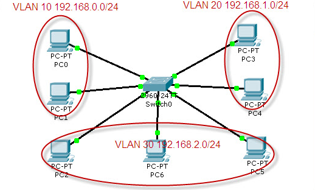

A.根据下图配置基本VLAN
  
1.搭建拓扑结构并配置IP
  
2.将PC1-6分别放到对应的VLAN中
在交换机上配置三个VLAN
以下为部分指令，以vlan 10为例
```
enable                          //进入特权模式
Switch#configure terminal       //进入全局配置
Enter configuration commands, one per line.  End with CNTL/Z.
Switch(config)#vlan 10          //创建vlan 10
Switch(config-vlan)#name vlan10 //命名为vlan10
Switch(config-vlan)#exit
```
以端口1为例，为端口1-7绑定VLAN
```
Switch(config)#interface FastEthernet0/1    //进入端口1配置模式
Switch(config-if)#switchport mode access    //设置端口模式为access
Switch(config-if)#switchport access vlan 10 //将断口0/1划分给vlan 10
```
在可视化界面可确认均配置成功。
  
使用show vlan显示所以端口
  

3.之后测试相同和不同VLAN下的PC机间能否ping通
  

测试结果为只有相同VLAN下的PC机间可以ping
把接口都显示出来的是这样的。
  

其实感觉到这里并不能说明是VLAN的划分使其通讯受影响（不同VLAN下PC网络号不同，本身就ping不了），因此我对其进行了进一步尝试。
  

将所有PC赋予相同的网络号，发现还是只有同VLAN下的PC间可以ping，至此实验结束。